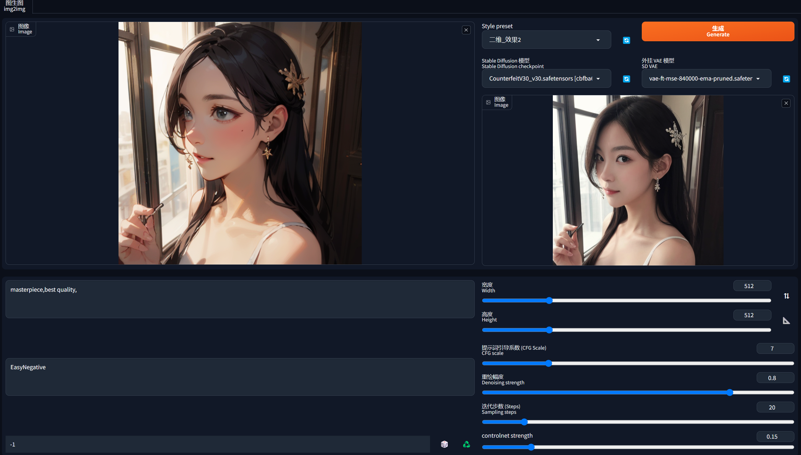

# stable-diffusion-webui-Style-Converter
a stable-diffusion-webui extension for style converter



## basic design
```
├── install.py (optional)
└── scripts
    ├── ${extension_name}.py
    ... (if extension need module division)
```

